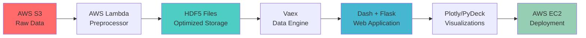

# 🔍 UrbanShield
### *Intelligent Crime Data Analytics & Forecasting Platform*

<div align="center">


</div>

---

## 📊 Overview

**UrbanShield** is an advanced crime data analytics platform that transforms raw Chicago crime data into actionable insights through interactive visualizations and predictive modeling. Built for data scientists, law enforcement analysts, and policy makers, this platform handles massive datasets efficiently while providing an intuitive user experience.

### ✨ Key Features

- **📈 Interactive Dashboard** - Real-time crime statistics with dynamic filtering by year, district, crime type, and month
- **📖 StoryLine Mode** - Data-driven narratives exploring crime patterns and trends
- **💡 Insights Analytics** - Pre-computed statistical analysis with 8+ interactive visualizations
- **🔮 Crime Predictor** - Time-series forecasting using ARIMA models for daily and monthly predictions
- **🗺️ Geospatial Visualization** - 3D elevation and scatter maps powered by PyDeck
- **⚡ High Performance** - Processes millions of records using Vaex for out-of-core computing

---

## 🏗️ Architecture



### Infrastructure Stack

| Component | Technology | Purpose |
|-----------|-----------|---------|
| **Data Storage** | AWS S3 | Scalable object storage for crime datasets |
| **Data Processing** | AWS Lambda | Serverless preprocessing to HDF5 format |
| **Compute** | AWS EC2 (4-core, 8GB) | Application hosting |
| **Data Engine** | Vaex | Fast out-of-core DataFrame operations |
| **Web Framework** | Dash + Flask | Interactive web application |
| **Visualization** | Plotly + PyDeck | Dynamic charts and geospatial maps |

---

## 🚀 Quick Start

### Prerequisites

- Python 3.8+
- Anaconda (recommended) or pip
- Docker (optional, for containerized deployment)

### Option 1: Local Setup (Anaconda)

```bash
# 1. Clone the repository
git clone <repository-url>
cd crime_data_visualtion-main/crime_files

# 2. Create conda environment
conda create -n chicago python=3.8.10 pip
conda activate chicago

# 3. Install dependencies
conda install -y -c conda-forge --file requirements.txt

# 4. Download dataset from S3
# Make sure dataset/cleaned_2006.hdf5 is available

# 5. Run the application
python app.py
```

The app will be available at `http://localhost:8080`

### Option 2: Docker Setup

```bash
# 1. Navigate to app directory
cd crime_files

# 2. Build Docker image
docker build -t urbanshield .

# 3. Run container
docker run -p 8080:80 urbanshield
```

Access at `http://localhost:8080`

---

## 📂 Project Structure

```
crime_data_visualtion-main/
├── crime_files/
│   ├── app.py                      # Main Dash application
│   ├── assets/                     # Static files (CSS, JS, images)
│   ├── datafilters/
│   │   └── DataFilter.py           # Data filtering & aggregation logic
│   ├── figures/
│   │   ├── Figures.py              # Dashboard visualization components
│   │   └── StatFigures.py          # Statistical charts & predictions
│   ├── dataset/
│   │   └── cleaned_2006.hdf5       # Preprocessed crime data
│   ├── predictor_model_code.html   # ARIMA model documentation
│   └── requirements.txt            # Python dependencies
├── app/
│   └── dist_20.csv                 # District data
├── wordcloud/                      # Word cloud assets
└── README.md
```

---

## 🎯 Features Deep Dive

### 1️⃣ Dashboard View
- **Dynamic Filters**: Year range, crime type, district, month
- **KPI Cards**: Total offenses, highest crime district, arrest rate, domestic abuse percentage
- **3D Crime Heatmap**: Elevation or scatter view of crime locations
- **Sunburst Chart**: Hierarchical crime type breakdown
- **Ranking Table**: Top 20 crime hotspots by district and type

### 2️⃣ StoryLine Mode
Explore guided data narratives:
- **Where We Are?** - Geographic crime distribution analysis
- **Effective Chicago PD?** - Arrest rate trends and police effectiveness
- **Criminals Sleep at Night** - Temporal patterns in crime occurrence
- **Criminals on Holiday** - Crime activity during holidays
- **Careful on Weekends** - Weekday vs. weekend crime comparison
- **Say No to Domestic Abuse** - Domestic violence trends

### 3️⃣ Insights Analytics
8 pre-built statistical visualizations:
- Crime trends over time
- District-wise crime distribution
- Seasonal patterns
- Crime type correlations
- Arrest effectiveness metrics
- Domestic violence analysis

### 4️⃣ Crime Predictor
- **ARIMA Forecasting**: Time-series predictions for future crime rates
- **Daily Predictions**: Next 30-day crime forecast
- **Monthly Predictions**: Next 12-month trend analysis
- **Model Notebook**: Full ARIMA implementation in `predictor_model_code.html`

---

## 🛠️ Technology Stack

| Category | Technologies |
|----------|-------------|
| **Backend** | Python 3.8, Flask |
| **Frontend** | Dash, HTML/CSS/JavaScript |
| **Data Processing** | Vaex, Pandas, NumPy |
| **Visualization** | Plotly, PyDeck |
| **ML/Forecasting** | Statsmodels (ARIMA) |
| **Infrastructure** | AWS S3, Lambda, EC2 |
| **Containerization** | Docker |

---

## 📊 Dataset

**Source**: Chicago Crime Data (2001-present)  
**Format**: HDF5 (optimized from CSV)  
**Size**: ~7M+ records  
**Update Frequency**: Daily

### Data Schema
- Date/Time of occurrence
- Primary crime type
- Location description
- District
- Arrest status
- Domestic violence flag
- Geographic coordinates

---

## 🌐 Deployment

### AWS EC2 Deployment

```bash
# 1. Launch EC2 instance (Ubuntu recommended)
# 2. SSH into instance and clone repository
git clone <repository-url>
cd crime_data_visualtion-main/crime_files

# 3. Build Docker image
docker build -t urbanshield .

# 4. Run in detached mode
docker run -d -p 8080:80 urbanshield

# 5. Configure security group to allow port 8080
```

Access your application at `http://<EC2-Public-IP>:8080`

---

</div>
